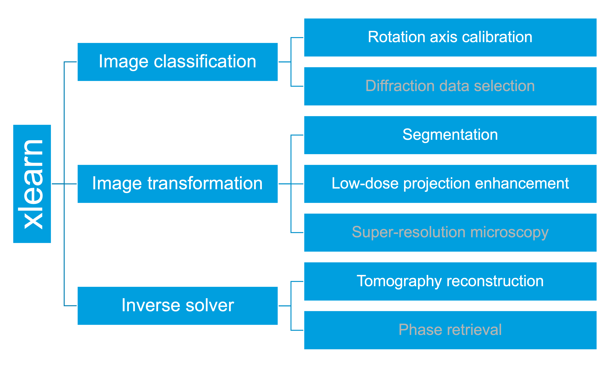

======
Xlearn
======

`Xlearn <https://github.com/tomography/xlearn>`_ is an open-source Python package implementing Deep Learning for X-ray Science.

Features
--------

* Correction of instrument and beam instability artifacts
* Low-dose image enhancement
* Feature extraction, segmentation
* Super-resolution X-ray microscopy

Contribute
----------

* Documentation: https://github.com/tomography/xlearn/tree/master/doc
* Issue Tracker: https://github.com/tomography/xlearn/docs/issues
* Source Code: https://github.com/tomography/xlearn/tree/master/xlearn

Content
-------

.. toctree::
   :maxdepth: 1

   source/about
   source/install
   source/api
   source/introduction
   source/demo
   source/credits
