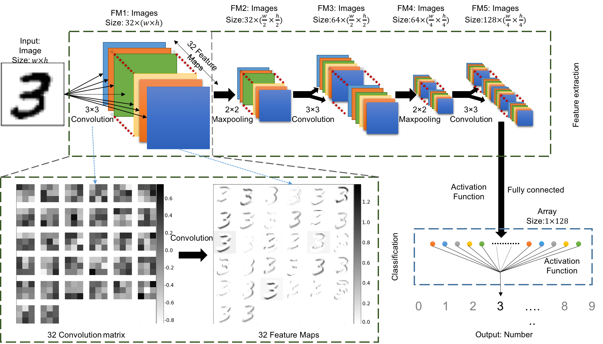

========
Classify
========

CNN was originally developed for image classifications. Its basic and most popular applications are hand-writing recognition and human face recognition. In these cases, CNN plays the role as a fitting function between the input images and the output labels. The process to fit the CNN model is so-called "train". The iterations during the "train" are called "epochs". Typically a Stochastic Gradient Descent (SGD) is used for training. Once the CNN is trained for a specific data model, we can use it as the function to estimate the label of an unknown image containing features that are close to the training data. This step is called "predict".

The process to prepare the training data decides the computing model. The more training data we prepare, the better the prediction results will be. Normally the number of training data should be at least on the magnitude of 10\ :sup:`4` for a reasonable prediction. This procedure is always considered difficult, because most of the steps for this task have to be done manually. in some cases, like solving a general image classification problems for nature images, this can be an overwhelming task and explains why machine learning techniques are yet not widely applied. However, for the image classification problems of synchrotron imaging, the image features are normally restricted to some specific aspect and therefore, we only need to use few images, or, in some cases, as discussed this in Section 3, even use the simulated images, to train the CNN model.

There is not a standard architecture of CNN for image classification. After we tested different architectures and parameter to consider their performances and stability, we choose to use the CNN architecture as shown in Fiure 1:

Figure 1: The architecture of the CNN classification model using for this article. We use the classification of handwriting number 3 as the example. This diagram shows how the handwriting image has been classified as its related number.

It includes 3 convolutional layers and 2 maxpooling layers. The first convolutional layer includes 32 convolution weights to extract 32 feature maps from the inputs. The image size reduces to half at each maxpooling layer. The number of convolution weights and feature maps doubles after each maxpooling layer. The final layer of the feature maps are fully connected to data nodes with the activation function. These nodes are connected again with another activation function and become a single value. We fit this value to be the label that defined in the training data. 

.. contents:: Contents:
   :local:
