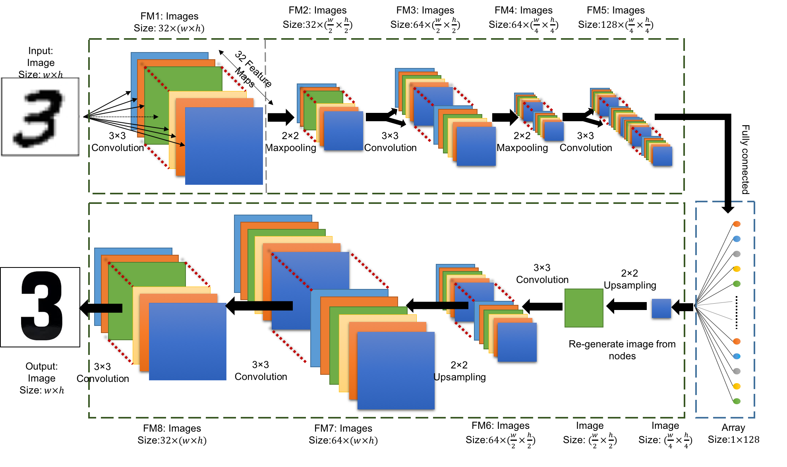

=========
Transform
=========

Inspired from the CNN classification model, we developed an image transformation model of CNN. The CNN classification model extracts the features of input image to build a link between the input image and output label. Our image transformation model extracts the features of the input image to build the link between the input image and output image, which has close feature of the input, but with different style.
 
The architecture of the transformation model is as shown in Figure 2. 

Figure 2: The architecture of the CNN transformation model using for this article. We use the transformation from handwriting number 3 to standard shape of 3 as the example.

Half architecture of the transformation model is the same as the classification model. The difference is that we do not connect the nodes of the fully connected layer to a single number. Instead, we transform it to an image with the same image size of the previous convolutional layer. After that, we keep using the upsampling layer and convolutional to convert the feature maps back to a single image. We use this image as the output data and fit the whole network from the input image. Once the network is trained between specific input and output image, we can transform the future images as the same rule of the training data.

.. contents:: Contents:
   :local:
