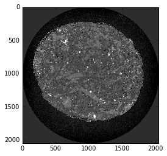

Train
-----

Here is an example on how to train a convolutional neural network to identify a 
tomographic reconstructed image that has the best center. 

The network is trained using one image off center and the best centered reconstruction.
Once the training is complete the network will be able to evaulate  a series of 
reconstructed images with different rotation center and select the one with the 
best center.

You can download the python scritp :download:`here <../../../doc/demo/classify_train.py>`
or the Jupyter notebook :download:`here <../../../doc/demo/classify_train.ipynb>`

To run this example please download the test data from the classify_train folder at 
`url <http://tinyurl.com/APS-xlearn>`_ 

.. code:: python

    import dxchange
    import numpy as np
    from xlearn.utils import nor_data
    from xlearn.utils import extract_3d
    from xlearn.utils import img_window
    from xlearn.classify import train

.. parsed-literal::

    Using Theano backend.
    Using gpu device 0: Tesla M2050 (CNMeM is disabled, cuDNN not available)

.. code:: python

    np.random.seed(1337)
    dim_img = 128
    patch_size = (dim_img, dim_img)
    batch_size = 50
    nb_classes = 2
    nb_epoch = 12

number of convolutional filters to use

.. code:: python

    nb_filters = 32

size of pooling area for max pooling

.. code:: python

    nb_pool = 2

convolution kernel size

.. code:: python

    nb_conv = 3

.. code:: python

    fname = '../../test/test_data/1038.tiff'
    img_x = dxchange.read_tiff(fname)

.. code:: python

    plt.imshow(img_x, cmap='Greys_r')
    plt.clim(-0.0005,0.0028)
    plt.show()

.. image:: rotation_train_files/rotation_train_10_0.png

.. code:: python

    ind_uncenter1 = range(1038, 1047)
    ind_uncenter2 = range(1049, 1057)
    uncenter1 = dxchange.read_tiff_stack(fname, ind=ind_uncenter1, digit=4)
    uncenter2 = dxchange.read_tiff_stack(fname, ind=ind_uncenter2, digit=4)
    uncenter = np.concatenate((uncenter1, uncenter2), axis=0)
    uncenter = nor_data(uncenter)

.. code:: python

    uncenter = img_window(uncenter[:, 360:1460, 440:1440], 200)

.. code:: python

    uncenter_patches = extract_3d(uncenter, patch_size, 1)

.. code:: python

    np.random.shuffle(uncenter_patches)

.. code:: python

    center_img = dxchange.read_tiff('../../test/test_data/1048.tiff')

.. code:: python

    plt.imshow(center_img, cmap='Greys_r')
    plt.clim(-0.0005,0.0028)
    plt.show()

.. code:: python

    center_img = nor_data(center_img)

.. code:: python

    center_img = img_window(center_img[360:1460, 440:1440], 400)
    center_patches = extract_3d(center_img, patch_size, 1)
    np.random.shuffle(center_patches)

.. code:: python

    x_train = np.concatenate((uncenter_patches[0:50000], center_patches[0:50000]), axis=0)
    x_test = np.concatenate((uncenter_patches[50000:60000], center_patches[50000:60000]), axis=0)
    x_train = x_train.reshape(x_train.shape[0], 1, dim_img, dim_img)
    x_test = x_test.reshape(x_test.shape[0], 1, dim_img, dim_img)
    y_train = np.zeros(100000)
    y_train[50000:99999] = 1
    y_test = np.zeros(20000)
    y_test[10000:19999] = 1

.. code:: python

    model = train(x_train, y_train, x_test, y_test, dim_img, nb_filters, nb_conv, batch_size, nb_epoch, nb_classes)

.. parsed-literal::

    (100000, 1, 128, 128) (100000, 2) (20000, 1, 128, 128) (20000, 2)
    Train on 100000 samples, validate on 20000 samples
    Epoch 1/12
    100000/100000 [==============================] - 836s - loss: 0.1251 - acc: 0.9604 - val_loss: 0.0726 - val_acc: 0.9704
    Epoch 2/12
    100000/100000 [==============================] - 835s - loss: 0.0085 - acc: 0.9977 - val_loss: 0.1675 - val_acc: 0.9311
    Epoch 3/12
    100000/100000 [==============================] - 835s - loss: 0.0045 - acc: 0.9989 - val_loss: 0.0155 - val_acc: 0.9949
    Epoch 4/12
    100000/100000 [==============================] - 832s - loss: 0.0034 - acc: 0.9990 - val_loss: 0.0090 - val_acc: 0.9976
    Epoch 5/12
    100000/100000 [==============================] - 834s - loss: 0.0018 - acc: 0.9995 - val_loss: 0.1212 - val_acc: 0.9512
    Epoch 6/12
    100000/100000 [==============================] - 835s - loss: 9.9921e-04 - acc: 0.9998 - val_loss: 0.0033 - val_acc: 0.9991
    Epoch 7/12
    100000/100000 [==============================] - 835s - loss: 5.3466e-04 - acc: 0.9999 - val_loss: 6.5040e-04 - val_acc: 1.0000
    Epoch 8/12
    100000/100000 [==============================] - 836s - loss: 7.6305e-04 - acc: 0.9998 - val_loss: 0.0016 - val_acc: 0.9997
    Epoch 9/12
    100000/100000 [==============================] - 833s - loss: 3.9566e-04 - acc: 0.9999 - val_loss: 8.2169e-04 - val_acc: 1.0000
    Epoch 10/12
    100000/100000 [==============================] - 835s - loss: 4.5675e-04 - acc: 0.9999 - val_loss: 8.0605e-04 - val_acc: 1.0000
    Epoch 11/12
    100000/100000 [==============================] - 833s - loss: 3.1511e-04 - acc: 1.0000 - val_loss: 8.0620e-04 - val_acc: 1.0000
    Epoch 12/12
    100000/100000 [==============================] - 833s - loss: 2.0671e-04 - acc: 1.0000 - val_loss: 8.0606e-04 - val_acc: 1.0000

.. parsed-literal::

    Test score: 0.000806061122949
    Test accuracy: 0.99995

.. code:: python

    model.save_weights('classify_training_weights.h5')

