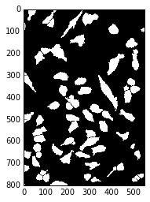

Train
-----

Here is an example on how to train a convolutional neural network.

You can download the python scritp :download:`here<../../../doc/demo/train.py>`
or the Jupyter notebook :download:`here<../../../doc/demo/train.ipynb>`

.. code:: python

    %pylab inline

.. parsed-literal::

    Populating the interactive namespace from numpy and matplotlib

.. code:: python

    import dxchange

Image data I/O in ConvNet is supported by 
`DXchange <http://dxchange.readthedocs.io>`__.

.. code:: python

    import matplotlib.pyplot as plt

matplotlib provide plotting of the result in this notebook.

`Install <http://convnet.readthedocs.io/en/latest/install.html>`__ ConvNet
then:

.. code:: python

    from convnet.transform import train
    from convnet.transform import model

.. code:: python

    batch_size = 800
    nb_epoch = 10
    dim_img = 20
    nb_filters = 32
    nb_conv = 3
    patch_step = 4
    patch_size = (dim_img, dim_img)

.. code:: python

    img_x = dxchange.read_tiff('../../convnet/data/training_input.tiff')
    img_y = dxchange.read_tiff('../../convnet/data/training_output.tiff')

.. code:: python

    plt.imshow(img_x, cmap='Greys_r')
    plt.show()

.. image:: train_files/train_4_0.png

.. code:: python

    plt.imshow(img_y, cmap='Greys_r')
    plt.show()

.. code:: python

    mdl = train(img_x, img_y, patch_size, patch_step, dim_img, nb_filters, nb_conv, batch_size, nb_epoch)
    mdl.save_weights('training_weights.h5')

.. parsed-literal::

    Epoch 1/10
    26068/26068 [==============================] - 39s - loss: 0.4458    
    Epoch 2/10
    26068/26068 [==============================] - 39s - loss: 0.2074    
    Epoch 3/10
    26068/26068 [==============================] - 39s - loss: 0.1607    
    Epoch 4/10
    26068/26068 [==============================] - 39s - loss: 0.1428    
    Epoch 5/10
    26068/26068 [==============================] - 39s - loss: 0.1321    
    Epoch 6/10
    26068/26068 [==============================] - 39s - loss: 0.1258    
    Epoch 7/10
    26068/26068 [==============================] - 39s - loss: 0.1244    
    Epoch 8/10
    26068/26068 [==============================] - 39s - loss: 0.1169    
    Epoch 9/10
    26068/26068 [==============================] - 39s - loss: 0.1135    
    Epoch 10/10
    26068/26068 [==============================] - 39s - loss: 0.1106    

